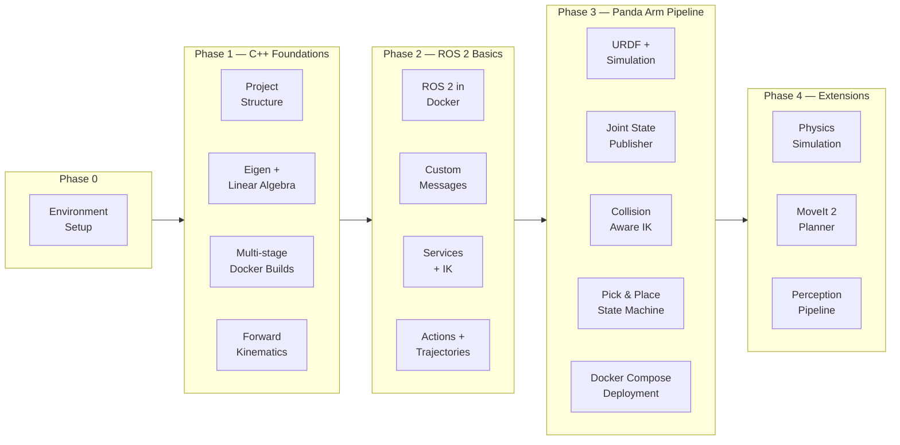
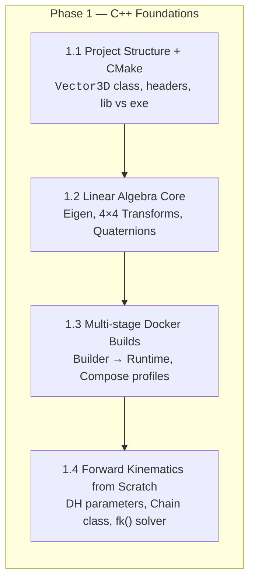
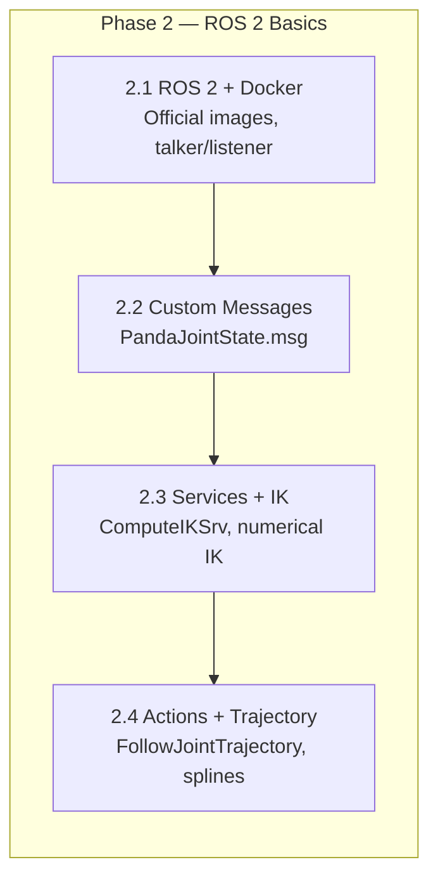
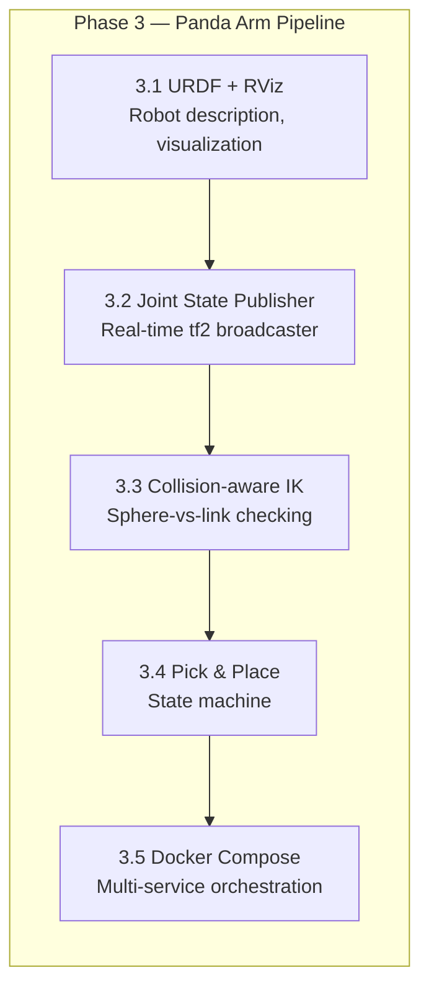
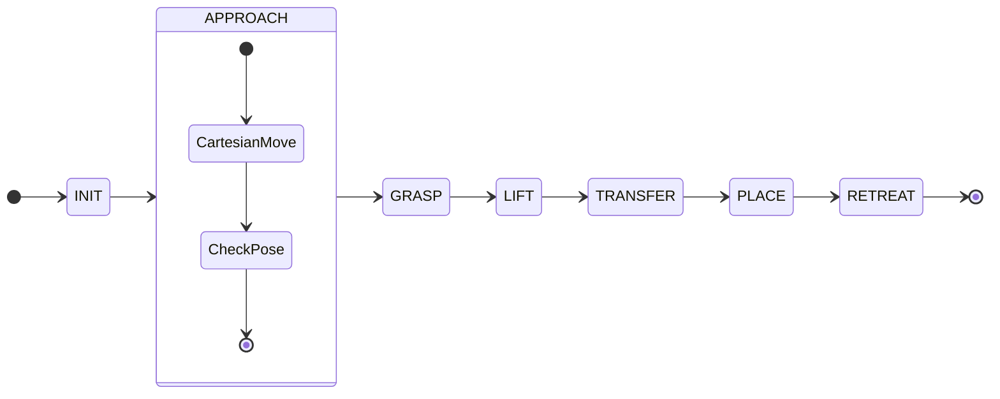

# C++ → ROS 2 → Docker → Robot Arm Manipulation

**Goal:** Build a complete pick-and-place pipeline for a simulated Franka Emika Panda 7-DOF robot arm, learning C++, ROS 2, and Docker along the way.

**Total estimated time:** ~13–16 sessions of ~1–2 hours each.

---

## Roadmap



---

## Phase 0 — Environment Setup

*(1 session)*

Get everything ready so the rest of the path is frictionless.

| Task | Outcome |
|------|---------|
| Install Docker Engine + Docker Compose | `docker run hello-world` works |
| Install VS Code + Docker extension | Can attach to running containers |
| Create the project layout | `src/`, `docker/`, `third_party/`, `scripts/` |
| Pull `ubuntu:24.04`, compile a trivial C++ executable inside a container | You see the full edit → build → run cycle in Docker |

**Deliverable:** A working Docker toolchain with a hello-world C++ app.

---

## Phase 1 — C++ Foundations, Containerized

*(~3 sessions)*

Build a **kinematics math library**. Every class maps directly to something a robot arm needs.



### Step 1.1 — Project Structure + CMake

```
kinematics_lib/
├── CMakeLists.txt
├── include/kinematics/
│   └── vector3d.hpp
├── src/
│   ├── vector3d.cpp
│   └── main.cpp
└── docker/
    ├── Dockerfile
    └── compose.yml
```

| Layer | Concept |
|-------|---------|
| C++ | Headers, translation units, `constexpr`, `namespace`, `#include` guards |
| CMake | `project()`, `add_library()`, `add_executable()`, `target_include_directories()` |
| Docker | `FROM ubuntu:24.04`, `apt install`, `COPY`, `RUN cmake`, `CMD` |

**Deliverable:** A `Vector3D` class with `dot()`, `cross()`, `norm()`, `normalize()` — compiled and running in a container.

### Step 1.2 — Linear Algebra Core (Eigen + Wrappers)

| Concept | Why it matters for the arm |
|---------|---------------------------|
| [Eigen](https://eigen.tuxfamily.org) library | De-facto linear algebra for robotics — ROS 2 uses it internally |
| `Transform` class (4×4 homogeneous matrix) | Every robot link's pose relative to its parent |
| `RotationMatrix` / `Quaternion` | Representing joint angles → end-effector orientation |
| GTest unit tests | Verify correctness — critical when you later trust this code to control a robot |

**Deliverable:** A `Transform` class wrapping Eigen, supporting `inverse()`, `compose()`, `transformPoint()`. Tests run via `docker compose run --rm test`.

### Step 1.3 — Multi-stage Docker Builds

```dockerfile
FROM ubuntu:24.04 AS builder    # full toolchain (cmake, g++, eigen-dev)
...
FROM ubuntu:24.04               # just runtime libs
COPY --from=builder /build/libkinematics.so /usr/local/lib/
```

| Concept | Outcome |
|---------|---------|
| Multi-stage build | Final image is lean (no cmake/g++ in production image) |
| Builder caching | Layer caching for deps vs source |
| `docker compose` profiles | `debug` (full image, GDB, sanitizers) vs `release` (slim, `-O2`) |

### Step 1.4 — Forward Kinematics from Scratch

Model the Panda arm as a kinematic chain using **Denavit–Hartenberg (DH) parameters**:

```
Joint 1 (base) → J2 → J3 → J4 → J5 → J6 → J7 → flange (gripper)
```

| C++ Concept | Usage |
|-------------|-------|
| `std::vector<Link>` | The chain of links |
| `std::array<double, 7>` | Joint angles (fixed-size, stack-allocated) |
| `enum class JointName` | Named joints (kJoint1, …, kJoint7) |
| `std::optional<Transform>` | Return type for bounds-checked access |

**Deliverable:** A CLI tool `fk_solver <q1 q2 ... q7>` that prints the end-effector position and orientation matrix. Verify correctness against the Panda datasheet.

---

## Phase 2 — ROS 2 Basics in Docker

*(~4 sessions)*

Introduce ROS 2 as the communication layer for your arm. Everything runs in containers.



### Step 2.1 — ROS 2 Humble + Docker

```dockerfile
FROM osrf/ros:humble-desktop
```

| New concept | What you do |
|-------------|-------------|
| Official `osrf/ros` images | Sourced entrypoint, `ROS_DISTRO` env var |
| `network_mode: host` in compose | ROS 2 DDS discovery needs multicast |
| `rclcpp` | Minimal `Talker` / `Listener` pair in C++ |
| `CMakeLists.txt` for ROS 2 | `find_package(rclcpp)`, `ament_target_dependencies()` |

**Deliverable:** Two containers, each running a node, publishing "hello from container" on a custom topic.

### Step 2.2 — Custom Message Types

```msg
# PandaJointState.msg
float64[7] position
float64[7] velocity
float64[7] effort
```

| Concept | Why |
|---------|-----|
| `.msg` files | You'll publish joint states for your arm |
| `rosidl_generate_interfaces()` | Custom types are essential for any real robot |
| `rclcpp::Publisher<PandaJointState>` | Template specialization for your type |

**Deliverable:** A publisher node sending simulated Panda joint angles (sine sweeps), a subscriber logging them.

### Step 2.3 — Services + Inverse Kinematics

```srv
# ComputeIKSrv.srv
float64[7] joint_angles_initial
geometry_msgs/Pose target_pose
---
bool success
float64[7] solution
```

Port your FK library into a ROS 2 node, then add a **numerical IK** solver:

| New ROS 2 | C++ |
|-----------|-----|
| `rclcpp::Service`, `rclcpp::Client` | Integrating Eigen with your `Chain::jacobian()` |
| Async spin patterns | Callback groups, `std::future` |

**Deliverable:** `ik_service` node — send it a target pose, get back joint angles. Test via `ros2 service call /compute_ik`.

### Step 2.4 — Actions + Trajectory Execution

```action
# FollowJointTrajectory.action
float64[7][] positions
builtin_interfaces/Duration[] time_from_start
---
bool success
---
float64 time_remaining   # feedback
```

| Concept | Why |
|---------|-----|
| `rclcpp_action::Server` | Arm motion is inherently an action (takes time, gives feedback) |
| Trajectory interpolation | Cubic spline between waypoints |
| `std::chrono` | ROS time, deadlines, trajectory timing |

**Deliverable:** An action server that accepts a joint-space trajectory and "plays it back" by publishing to `/joint_states`.

---

## Phase 3 — Panda Arm Pick-and-Place Pipeline

*(~5–6 sessions)*

The crown jewel. A complete pick-and-place pipeline for the simulated Panda arm.



### Step 3.1 — URDF + Simulation

| Concept | What you learn |
|---------|---------------|
| URDF | XML robot description — links, joints, collision geometry, visual meshes |
| `robot_state_publisher` | Publishes `tf2` tree from joint states |
| RViz | Visualization of the arm, TF tree, markers |
| Docker + GUI | X11 forwarding, `--net=host`, `--ipc=host` |

**Deliverable:** Panda arm visible in RViz, with a `joint_state_publisher_gui` slider panel.

### Step 3.2 — Real-time Joint State Publisher

Replace the GUI slider with your own C++ node:

- Reads a trajectory from the action server (Step 2.4)
- Publishes `sensor_msgs/JointState` at 100 Hz
- Publishes `tf2` via `tf2_ros::TransformBroadcaster`

**Deliverable:** Panda arm in RViz following a computed joint-space trajectory.

### Step 3.3 — Collision-aware IK

Add a collision-checking layer:

| Concept | Learning |
|---------|----------|
| Sphere-vs-sphere collision | Quick link approximation |
| Multiple IK seeds | Retry with randomized initial guesses |
| Reachability checking | Is the target pose even within the workspace? |

**Deliverable:** IK that rejects solutions colliding with a known obstacle (visualized as a sphere marker in RViz).

### Step 3.4 — Pick-and-Place State Machine

```
[INIT] → [APPROACH] → [GRASP] → [LIFT] → [TRANSFER] → [PLACE] → [RETREAT] → [DONE]
```



| Concept | Implementation |
|---------|---------------|
| `rclcpp::Timer` tick | State machine advances at fixed rate |
| Cartesian path | Linear end-effector motion (approach/retreat) |
| Gripper control | Open/close via `JointState` |
| Error recovery | What if IK fails? Retry / abort / re-approach |

**Deliverable:** `docker compose up` starts a system that repeatedly picks an object from position A and places it at position B.

### Step 3.5 — Full Docker Compose Deployment

```yaml
services:
  robot_state_publisher:  # loads URDF, publishes tf
  joint_state_publisher:  # your node from 3.2
  ik_service:             # your IK solver from 2.3
  trajectory_server:      # your action server from 2.4
  pick_and_place:         # state machine from 3.4
  rviz:                   # visualization (optional)
```

| Concept | New |
|---------|-----|
| ROS 2 domain ID | `ROS_DOMAIN_ID` to isolate from other ROS instances |
| Service dependencies | `depends_on` with health checks |
| Shared volumes | URDF files mounted read-only across containers |

**Deliverable:** A single `docker compose up` starts the entire arm pipeline.

---

## Phase 4 — Extensions (Optional)

| Idea | What it teaches |
|------|----------------|
| **Gazebo / Ignition sim** | Physics simulation — gravity, collisions, gripper friction |
| **MoveIt 2 C++ API** | Replace your IK with OMPL/STOMP planners (better paths, collision-free) |
| **Perception pipeline** | Aruco marker detection → object pose → pick target |
| **`ros2bag` recording** | Record a pick-place run, replay it for debugging |
| **ROS 2 Launch files** | Parameterize which arm, objects, and planner from YAML |
| **CI pipeline** | GitHub Actions that build + test in Docker on every push |
| **Real-time profiling** | Profile your IK solver, optimize for 1 kHz |

---

## System Architecture (Phase 3)

```mermaid
graph TB
    subgraph Host["Your Machine"]
        DOCKER[Docker Engine]
    end

    subgraph Compose["docker compose"]
        subgraph ROS_Network["ROS 2 Domain (ROS_DOMAIN_ID=42)"]
            RSP[robot_state_publisher<br/>URDF → tf2]
            JSP[joint_state_publisher<br/>sensor_msgs/JointState]
            IK[ik_service<br/>ComputeIKSrv]
            TS[trajectory_server<br/>FollowJointTrajectory<br/>ActionServer]
            PNP[pick_and_place<br/>State Machine]
            RVIZ[rviz2<br/>Visualization]
            MCD[moveit_core<br/>(Phase 4)]
        end

        subgraph Volumes["Shared Volumes"]
            URDF[(panda.urdf)]
        end
    end

    RSP --> URDF
    JSP -- "/joint_states" --> RSP
    IK -- "fk/jacobian" --> TS
    TS -- "/joint_states" --> JSP
    PNP -- "ComputeIKSrv" --> IK
    PNP -- "FollowJointTrajectory" --> TS
    RVIZ --> RSP

    DOCKER --> Compose
```

---

## Repository Layout

```
cpp-ros2/
├── LEARNING_PATH.md           # ← You are here
├── README.md                  # Project overview
├── .gitignore
├── docker/
│   ├── Dockerfile.kinematics  # Phase 1
│   ├── Dockerfile.ros         # Phase 2
│   ├── docker-compose.kinematics.yml
│   └── docker-compose.panda.yml  # Phase 3
├── phase1_kinematics/
│   ├── CMakeLists.txt
│   ├── include/
│   │   └── kinematics/
│   │       ├── vector3d.hpp
│   │       ├── transform.hpp
│   │       └── chain.hpp
│   ├── src/
│   │   ├── vector3d.cpp
│   │   ├── transform.cpp
│   │   ├── chain.cpp
│   │   └── main.cpp
│   └── test/
│       ├── CMakeLists.txt
│       └── test_kinematics.cpp
├── phase2_ros_basics/
│   ├── talker_listener/
│   ├── panda_interfaces/     # msg, srv, action files
│   ├── ik_service/
│   └── trajectory_server/
├── phase3_panda_pipeline/
│   ├── joint_state_publisher/
│   ├── ik_service_ros/
│   ├── trajectory_server/
│   ├── pick_and_place/
│   └── urdf/
│       └── panda/
└── scripts/
    ├── build.sh
    └── run.sh
```

---

## How to Use This Document

1. **Read the whole thing once** to get the lay of the land.
2. **Start at Phase 0** — don't skip environment setup.
3. **Each step builds on the previous one.** The FK library from Phase 1 is used directly in Phase 2's IK service, which is used by Phase 3's state machine.
4. **Don't rush.** If a step's concepts don't feel solid, re-read and experiment before moving on.
5. **Ask questions.** Every time we work together, I'll explain the new concepts in context.

---

## Quick Reference — Key Technologies

| Technology | What it is in this project | Where to learn more |
|-----------|---------------------------|---------------------|
| **C++17/20** | Core robot logic (kinematics, IK, trajectory planning) | [cppreference.com](https://en.cppreference.com/) |
| **CMake** | Build system for C++ | [Modern CMake](https://cliutils.gitlab.io/modern-cmake/) |
| **Eigen 3** | Linear algebra library | [eigen.tuxfamily.org](https://eigen.tuxfamily.org/) |
| **ROS 2 Humble** | Inter-process communication, robot abstractions | [docs.ros.org](https://docs.ros.org/en/humble/) |
| **rclcpp** | ROS 2 C++ client library | [ROS 2 Tutorials](https://docs.ros.org/en/humble/Tutorials.html) |
| **MoveIt 2** | Motion planning framework (Phase 4) | [moveit.ros.org](https://moveit.ros.org/) |
| **Docker Engine** | Container runtime | [docs.docker.com](https://docs.docker.com/) |
| **Docker Compose** | Multi-container orchestration | [docs.docker.com/compose](https://docs.docker.com/compose/) |
| **URDF** | Robot description format | [URDF Tutorials](http://wiki.ros.org/urdf/Tutorials) |
| **RViz** | 3D visualization for ROS | [RViz docs](https://github.com/ros2/rviz) |
